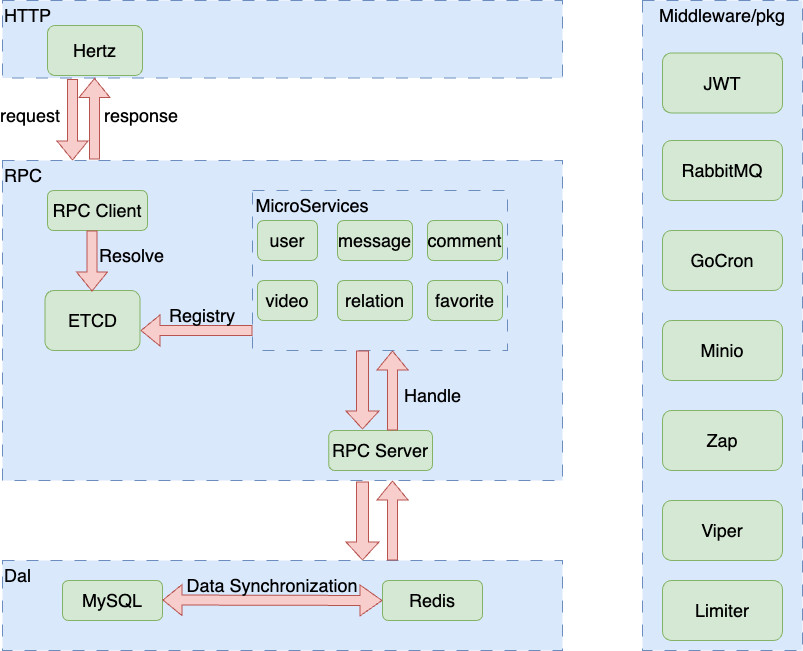
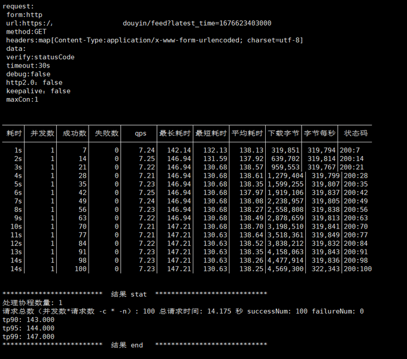
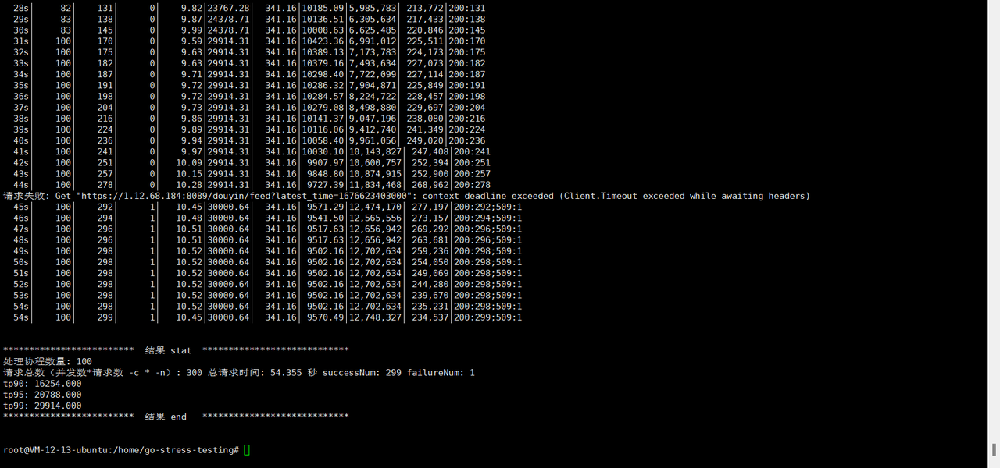
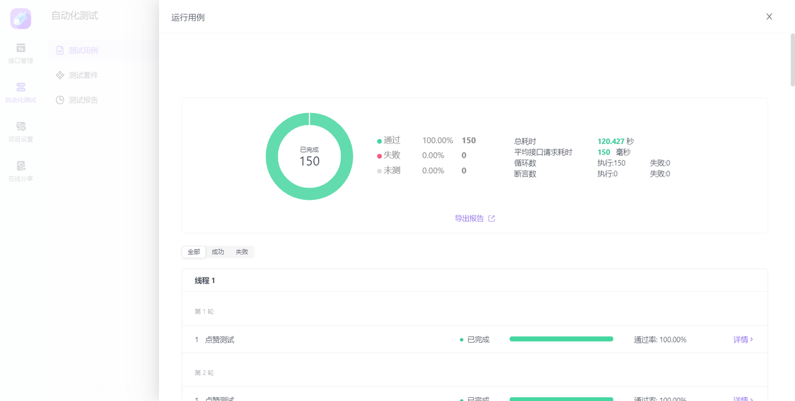
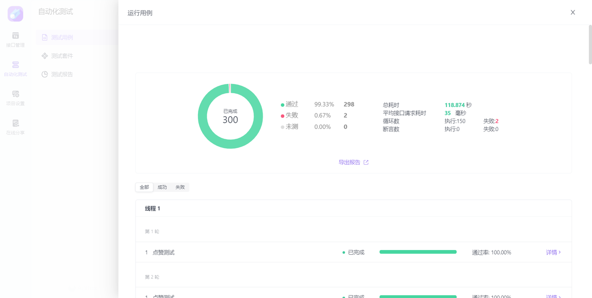
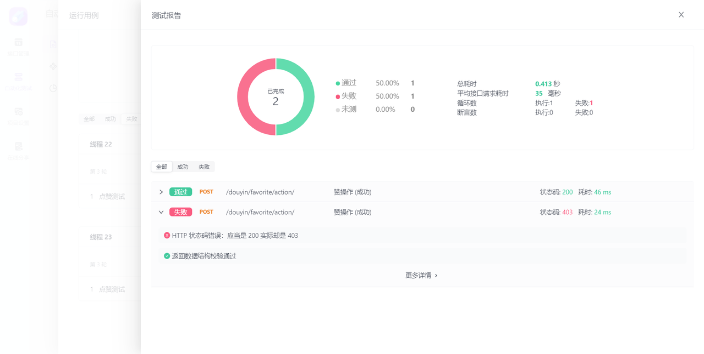
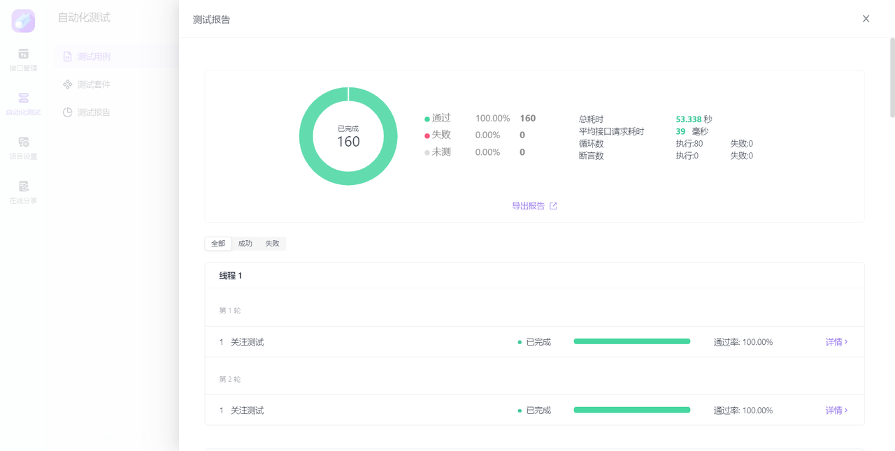
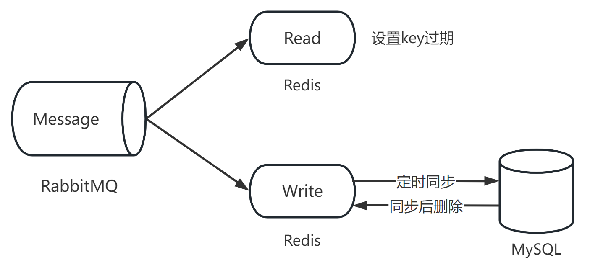

# 5th-bytedance-youth-camp-tiktok

# 一、项目介绍

**基于 “Hertz/Gin HTTP框架 + Kitex 微服务框架” 完成的第五届字节跳动青训营—极简版抖音项目**

- Github 地址：https://github.com/bytedance-youthcamp-jbzx/tiktok

# 二、项目实现

## 2.1 技术选型与相关开发文档

本项目包含三大类接口：基础接口、互动接口、社交接口。采用微服务架构以及 Docker 部署的方式。总共需要 16G 存储空间，1
台服务器，项目中所需要的数据库以及中间件均由 Docker 下载并挂载运行。

以下是开发文档。

[ApiFox开发文档](https://www.apifox.cn/apidoc/shared-7b33652d-6080-41bb-a70e-7a165d55daae/api-63185966)

## 2.2 架构设计

### 2.2.1 架构方案

由于抖音的各接口之间耦合度不高，故采用微服务的架构，分为 HTTP、RPC 和 DAL 三层：

- 其中 HTTP 层使用 Hertz 框架接收客户端发来的 HTTP 请求；
- RPC 层使用 Kitex 框架，并用 ETCD 做服务注册与发现；
- DAL 层为数据访问层，包含 Redis 和 MySQL 两部份。

当客户端发来 HTTP 请求时，HTTP 层会调用 RPC层 的 RPC Client，然后 RPC Client 去 ETCD 中心寻找已经注册的对应的微服务，交给
RPC Server 处理。RPC Server 会去调用 DAL 层的数据库，数据库处理完毕后把结果返回给 RPC Server，RPC Server 将其返回给 RPC
Client，最后 RPC Client 返回给 Hertz 并由 Hertz 返回 HTTP 响应结果。

### 2.2.2 架构图

## 2.3 项目代码介绍

### 2.3.1 技术栈

- Hertz：提供 HTTP 服务；Kitex：提供 RPC 服务；ETCD：服务注册与发现；
- JWT：token 的生成与校验；
- Minio：图片和视频的对象存储；
- Gorm：对 MySQL 进行 ORM 操作，Go-Redis：操作 Redis 对频繁访问的数据进行缓存，使用 Gorm 的 db-resolver 插件进行读写分离操作；
- Redis：对点赞/取消赞和关注/取关操作进行缓存，按照一定策略使键过期，并定时同步数据到数据库；
- RabbitMQ：对 Redis 的异步操作、流量削峰；
- Gocron：定时任务，同步 Redis 与 MySQL 之间的数据；
- Viper：读取配置文件；
- Zap：日志打印；Lumberjack：日志分割；
- Nginx：反向代理与负载均衡。

### 2.3.2 目录结构介绍

|     目录      |    子目录     |               说明               |                                   备注                                    |
|:-----------:|:----------:|:------------------------------:|:-----------------------------------------------------------------------:|
|     cmd     |    api     |            api 服务代码            |                       包含http server 和 RPC client                        |
|             |  comment   |         comment 微服务代码          |                                                                         |
|             |  favorite  |         favorite 微服务代码         |                                                                         |
|             |  message   |         message 微服务代码          |                                                                         |
|             |  relation  |         relation 微服务代码         |                                                                         |
|             |    user    |           user 微服务代码           |                                                                         |
|             |   video    |          video 微服务代码           |                                                                         |
|   config    |            |         微服务以及第三方包的配置文件         |                                                                         |
|     dal     |     db     |          操作 MySQL 代码           |                   包含 Gorm 初始化、Gorm 结构体以及 MySQL 的操作逻辑                    |
|             |   redis    |          操作 Redis 的代码          |       包含 go-redis 初始化、Redis 结构体、Redis 操作逻辑以及 Redis 与MySQL 数据同步的逻辑       |
| dockerfiles |    api     |     API 服务的 DockerFIle 文件      |                                                                         |
|             |    rpc     |     RPC 服务的 DockerFile 文件      |                                                                         |
|  internal   |  response  |            封装返回的结构体            |                                                                         |
|             |    tool    |          封装项目中常用的工具函数          |               包含 RSA、MD5、SHA256 等加密算法以及操作 ffmpeg 对上传视频截图                |
|    kitex    |            | 包含 proto 文件以及由 Kitex 生成的 go 代码 |                     Kitex 生成的 Go 代码在 Kitex_gen 子目录下                     |
|     pic     |            |             保存一些图片             |                                                                         |
|     pkg     |   errno    |             错误码的实现             |                                                                         |
|             |    etcd    |            服务注册与发现             |                                                                         |
|             |   gocron   |              定时任务              |                                                                         |
|             |    jwt     |           token生成与校验           |                                                                         |
|             | middelware |             常用的中间件             |                                                                         |
|             |   minio    |              对象存储              |                                                                         |
|             |  rabbitmq  |              消息队列              |                                                                         |
|             |   viper    |              配置读取              |                                                                         |
|             |    zap     |           日志打印与日志切割            |                                                                         |
|   scripts   |            |             存放启动脚本             | 包含使用 Docker 启动的 MySQL、Redis、etcd、nginx、rabbitmq、minio 等，以及 MySQL主从复制的配置 |

# 三、测试结果

## 3.1 功能测试

|  功能项  | 功能需求      | 测试点                                          |        模块        |  结果  |
|:-----:|-----------|----------------------------------------------|:----------------:|:----:|
| 基础功能项 | 视频 Feed 流 | 支持所有用户刷抖音，视频按投稿时间倒序推出                        |      获取视频列表      | 正确运行 |
|       | 视频投稿      | 支持登录用户自己拍视频投稿                                |       发布视频       | 正确运行 |
|       | 个人主页      | 支持查看用户基本信息和投稿列表，注册用户流程简化                     |        注册        | 正确运行 |
|       |           |                                              |        登录        | 正确运行 |
|       |           |                                              |       个人信息       | 正确运行 |
| 方向功能项 | 喜欢列表      | 登录用户可以对视频点赞，在个人主页喜欢Tab 下能够查看点赞视频列表           |      获取喜欢列表      | 正确运行 |
|       |           |                                              |        点赞        | 正确运行 |
|       |           |                                              |       取消赞        | 正确运行 |
|       | 用户评论      | 支持未登录用户查看视频下的评论列表，登录用户能够发表评论                 |      获取评论列表      | 正确运行 |
|       |           |                                              |       新增评论       | 正确运行 |
|       |           |                                              |       删除评论       | 正确运行 |
|       | 关系列表      | 登录用户可以关注其他用户，能够在个人主页查看本人的关注数和粉丝数，查看关注列表和粉丝列表 |        关注        | 正确运行 |
|       |           |                                              |        取关        | 正确运行 |
|       |           |                                              | 获取关系列表（关注、粉丝、朋友） | 正确运行 |

## 3.2 性能测试

### 3.2.1 视频流测试

### 3.2.2 点赞测试

- **注：返回** **`403`** **为中间件限流结果。**

### 3.2.3 关注测试

# 四、项目总结与反思

## 4.1 目前仍存在的问题

- **作品发布：** 在作品异步发布下，不能提示用户视频上传失败。
- **消息记录：** 聊天记录获取使用 Redis 作为缓存，每条记录的过期时间为两秒。若 `用户A` 退出与 `用户B` 聊天界面，并在 Redis
  记录未过期之前重新打开与 `用户B`
  的聊天界面，则不会显示聊天记录。如果处理速度跟不上请求速度，导致请求排队，那么在用户退出聊天界面的两秒后不一定能使 `用户A`
  与 `用户B` 的记录在 Redis 中过期。
- **代码简洁性：** 每次抛出错误时都会在后面紧跟日志记录和错误返回，导致代码不简洁。=> 考虑打包处理
- **多人点赞、关注同步问题：** 多人同时点赞或关注同一个对象，最后的结果未达到预期。
- **数据库同步问题：** 若 Redis 与 MySQL 同步时仍有请求进入，则会丢弃后面请求的数据。

## 4.2 已识别出的优化项

- **消息队列 + 缓存 + 定时同步：** 对可能访问频繁的内容（点赞和关注）做分流和缓存处理，避免该类操作反复访问数据库进行 I/O
  操作而造成的处理缓慢。利用单个消费者从 RabbitMQ
  队列中取出消息，保证其与请求顺序的一致性，将点赞数据分别缓存与两个 `Redis` 键中，记作 `Read` 和 `Write`（键后缀为 `r`
  和 `w`）：`Read` 作为高访问率的缓存，设定为定时过期以减轻内存压力；`Write` 不设置过期，定时将数据同步到数据库中，同步后删除
  Redis 中的数据。此处设定将 **同步前最后一次修改后的数据** 作为同步数据，同步时对 Redis 键进行加锁，同步完成释放锁，若此时还有数据到达，则丢弃数据。
- **聊天记录获取 + 缓存：** 由于获取消息记录是轮询方案，不能使其直接访问数据库。本优化方案使用 **Redis 缓存**
  获取到的消息，当第一次进入聊天界面时，缓存按照 `{key: token_toUserID, value: create_time}` 存储，并设置过期时间为两秒，当用户发送消息时，更新
  key 对应的 value 为最新发送消息时间。
- **作品异步发布：** 抖声 APP 发布作品请求的最大等待时长为五秒。若等待超时，则无论视频是否发布成功，都返回为“上传失败”。本方案改进为先在数据库中插入记录，再利用
  **协程** 进行异步视频上传。若视频上传失败，则删除刚刚新增的记录。
- **令牌桶消费互斥：** 多个线程竞争同一个 token 做互斥操作。

“消息队列 + 缓存 + 定时同步” 图示

## 4.3 架构演进的可能性

- 分库分表
- 链路追踪
- 分布式
- 云原生
- Kubernetes

## 4.4 项目过程中的反思与总结

前期一定要确定好需求，否则后面改动起来相当麻烦。边界条件是测试的重点，在后期漏洞修补有重要作用。

---

# Note
### 第五届字节跳动青训营抖音项目

- 初始化了数据交互的目录结构以及代码
- 创建了数据库表（包含外键、依赖），参考了 <a href="https://github.com/a76yyyy/tiktok">第三届字节青训营的内容</a>
- <a href="https://www.apifox.cn/apidoc/shared-09d88f32-0b6c-4157-9d07-a36d32d7a75c">极简版抖音APP接口文档</a>

| 数据库表名                    | Golang 类名                                | 备注           |
|--------------------------|------------------------------------------|--------------|
| comment                  | Comment                                  | 评论           |
| messages                 | Message                                  | 聊天消息         |
| relation                 | FollowRelation (/relation.go)            | 社交（粉丝、关注、朋友） |
| user                     | User                                     | 用户           |
| video                    | Video (/feed.go)                         | 视频           |
| user_favorite_videos     | FavoriteVideoRelation (/favorite.go)     | 视频点赞记录       |
| _user_favorite_comments_ | _FavoriteCommentRelation (/favorite.go)_ | _评论点赞记录_     |

注：

- 聊天消息为本届项目新增内容，评论点赞记录未开发。
- 朋友为互相关注的用户

#### 启动/停止运行

- 启动服务：`sh startup.sh`
- 停止运行：`sh shutdown.sh`
